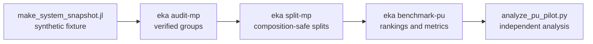

# Eka

**Reading the gaps in the inorganic record.**

[](https://github.com/JoshCCorby/EkaCompositions.jl/actions/workflows/ci.yml) [](https://JoshCCorby.github.io/EkaCompositions.jl/dev/) [](https://github.com/JoshCCorby/EkaCompositions.jl/releases/latest) [](LICENSE)

Eka ranks canonical chemical compositions and evaluates reproducible recovery experiments. It is for researchers testing stored scores and composition-level ranking methods. It supports SQLite score queries and positive–unlabelled recovery benchmarks.

## Quick start

Requires Julia 1.10 or newer. From a repository checkout:

```bash
julia --project=. -e 'using Pkg; Pkg.instantiate(); Pkg.precompile()'
julia --project=. bin/eka -e Al Si O -n 4 -d test/fixtures/tiny_test.db
```

```text
# Composition, Score
Al2Ba2O7Si1   0.74232
Al2O12Si3Zn3   0.48140
Al1Li1O12Si5   0.41613
Al2Ba3O14Si4   0.39355
Al2O14Si4Sr3   0.34611
```

The fixture has 12 rows for software testing: eight composition/score pairs reused from Seko's published examples and four project-authored cases. They are not predictions generated by Eka; see [third-party notices](THIRD_PARTY_NOTICES.md). Queries and tests need no network access after installation.

## Pipeline overview



## Commands

| Command | Purpose | Guide |
| --- | --- | --- |
| `eka -d PATH [options]` | Query and rank stored SQLite scores. | [Production validation](docs/production-validation.md) |
| `eka import` | Build a new query database from scored TSV records. | [Design notes](docs/design.md) |
| `eka validate` | Audit every record in a SQLite database. | [Production validation](docs/production-validation.md) |
| `eka benchmark` | Evaluate binary-labelled rankings at fixed budgets. | [Benchmark contract](docs/benchmarking.md) |
| `eka audit-mp` | Verify and group an MP-shaped snapshot. | [MP pilot](docs/mp-pilot.md) |
| `eka split-mp` | Generate deterministic PU splits. | [Split guide](docs/mp-recovery-splits.md) |
| `eka benchmark-pu` | Verify splits and evaluate PU methods. | [PU evaluation](docs/mp-pu-evaluation.md) |

Append `--help` to any subcommand. Bare `--help` describes SQLite queries.

| Query option | Meaning | Default |
| --- | --- | --- |
| `-d`, `--database PATH` | Existing SQLite database. | Required |
| `-e`, `--elements [ELEMENTS ...]` | Require every listed element. | Unrestricted |
| `-n`, `--nary [NARY ...]` | Allow these numbers of distinct elements. | `3` |
| `--threshold NUMBER` | Minimum stored score, inclusive. | `0.01` |
| `--strict-threshold` | Use `score > threshold`. | Off |
| `--rank score\|similarity` | Select the ordering method. | `score` |
| `--reference FORMULA` | Set the similarity reference. | Required with similarity |

## Library usage

```julia
using EkaCompositions

composition = Composition("Zn1Mg2")
@assert formula(composition) == "Mg2Zn1"
@assert composition == Composition("Mg2Zn1")
@assert Composition("Mg2Zn2") == Composition("MgZn")
@assert length(Set([Composition("MgZn"), Composition("Zn2Mg2")])) == 1
```

```julia
using EkaCompositions

results = query_compositions("test/fixtures/tiny_test.db";
    elements=["Al", "Si", "O"], nary=[4], threshold=0.3)

for (composition, score) in results
    println(formula(composition), " => ", score)
end
```

- Formulas use valid element symbols and positive integer amounts.
- Repeated symbols are combined and counts reduce to the simplest ratio.
- Equality and hashing ignore element order and overall scale.
- Parentheses, isotopes, charges, whitespace and fractional amounts are unsupported.

## Benchmarks

The commands below use new temporary output paths. Run them from the repository root in one shell session.

```bash
readme_run=$(mktemp -d /tmp/eka-readme-recon.XXXXXX)
```

### Binary labelled ranking

This compares supplied scores with random and training-element-popularity baselines on an explicit labelled pool. See the [benchmark contract](docs/benchmarking.md).

```bash
julia --startup-file=no --project=. bin/eka benchmark --input examples/benchmark/candidates.tsv --training examples/benchmark/training.tsv --methods score,random,popularity --budget 2 5 10 --seeds 0 1 2 --source 'Synthetic software example v1; arbitrary scores and outcomes, disjoint hand-authored pools' --output "$readme_run/binary"
```

### Materials Project recovery pilot

This measures recovery of held-out positive-provenance compositions with three PU ranking methods. See the [pilot guide](docs/mp-pu-evaluation.md).

```bash
julia --startup-file=no --project=. examples/mp_recovery/make_system_snapshot.jl "$readme_run/snapshot"
julia --startup-file=no --project=. bin/eka audit-mp --snapshot "$readme_run/snapshot" --output "$readme_run/audit"
julia --startup-file=no --project=. bin/eka split-mp --snapshot "$readme_run/snapshot" --audit "$readme_run/audit" --output "$readme_run/splits" --synthetic --seeds 0 1 --budget 1 4
julia --startup-file=no --project=. bin/eka benchmark-pu --splits "$readme_run/splits" --snapshot "$readme_run/snapshot" --audit "$readme_run/audit" --output "$readme_run/pilot" --synthetic
python3 scripts/analyze_pu_pilot.py "$readme_run/pilot" "$readme_run/pilot-analysis"
```

### Label sensitivity

This tests how mixed provenance flags affect fixed rankings and fully rebuilt pipelines. See the [label-sensitivity guide](docs/mp-label-sensitivity.md).

```bash
julia --startup-file=no --project=. scripts/run_label_sensitivity.jl "$readme_run/snapshot" "$readme_run/audit" "$readme_run/pilot" "$readme_run/sensitivity" --synthetic
python3 scripts/analyze_label_sensitivity.py "$readme_run/sensitivity" "$readme_run/sensitivity-analysis"
```

### Chemical-system holdout

This compares formula holdout with whole-system holdout across three label policies. See the [system-holdout guide](docs/mp-system-holdout.md).

```bash
julia --startup-file=no --project=. scripts/run_system_holdout.jl "$readme_run/snapshot" "$readme_run/audit" "$readme_run/sensitivity" "$readme_run/system" --synthetic
python3 scripts/analyze_system_holdout.py "$readme_run/system" "$readme_run/system-analysis"
```

### Element-pair model

This evaluates a fixed rank-four nonnegative factor model fitted to training element-pair counts. See the [element-pair guide](docs/mp-element-pair.md).

```bash
julia --startup-file=no --project=. scripts/run_element_pair.jl "$readme_run/snapshot" "$readme_run/audit" "$readme_run/system" "$readme_run/pair" --synthetic
python3 scripts/analyze_element_pair.py "$readme_run/pair" "$readme_run/pair-analysis"
```

| Status | Workflow |
| --- | --- |
| ✅ | Binary benchmark implementation and synthetic example |
| ✅ | MP pilot, label sensitivity, system holdout and element-pair evaluation completed and reproduced locally |
| 🔒 | Real snapshots, record-level results, rankings, factors and environments held locally pending artifact-specific review |
| 🚧 | Any larger or tuned model requires a new question and prospective protocol |

## Scope and limitations

- A `Composition` represents a reduced element ratio. It does not represent molecular identity or crystal structure.
- Stored-score queries and binary benchmarks do not train a model or establish stability, synthesizability or experimental validity.
- Binary outcomes require an explicit measured definition. Missing and unobserved compounds are not negative outcomes. Upstream scores require a leakage-safe training split.
- The MP pool contains oxygen-bearing ternaries. It is not a validated oxide classification. Positive labels are experimental-provenance proxies; unlabelled compositions are not confirmed failures.
- Similarity is cosine overlap between element-count vectors. It is not a probability, learned embedding or chemical-substitution model.
- Existing Seko scores remain outside the primary MP comparison because training independence was not established.
- Synthetic outputs demonstrate software behaviour. They are not scientific evidence.
- MP timestamps do not establish discovery chronology. Results apply to the declared source snapshot, pool, policies and budgets.

## Database contract

Eka reads an existing standard `composition`/`score` table or the recognised `data2`, `data3`, `data4ionic` and `data5ionic` layout. Files open read-only. Formulas and finite scores are validated strictly.

```sql
CREATE TABLE compositions (
    composition TEXT NOT NULL,
    score REAL NOT NULL
);
CREATE INDEX compositions_score_idx ON compositions(score);
```

The `data4ionic` and `data5ionic` tables cover ionic records only. Queries do not create, modify or fully audit a database. See [design decisions](docs/design.md) and [production validation](docs/production-validation.md) for schema inspection, filtering and index behaviour.

## Pluggable ranking

SQLite strategies rank stored-score rows. PU methods use the separate `pu_rank` and `pu_metrics` interfaces, which are experimental; see [API stability](docs/api-stability.md).

```julia
using EkaCompositions

rows = query_compositions("test/fixtures/tiny_test.db"; nary=[2])
struct PreferBinary <: AbstractRankingMethod end
EkaCompositions.ranking_value(::PreferBinary, c::Composition, score::Real) = length(c) == 2 ? 1.0 : 0.0
ranked = rank_compositions(rows, PreferBinary())
```

Ranking values must be finite. Ties use descending stored score and then canonical formula.

## API stability

Exported names are classified as stable, stable-CLI, or experimental for the
0.1.x series, alongside the database-schema and report-format guarantees, in
[API stability](docs/api-stability.md). The classification is enforced by
`test/test_api.jl`.

## Development

Setup, test commands, the protocol-freeze rules and the distinction between a
software fix and a new experiment are in [CONTRIBUTING](CONTRIBUTING.md).

```bash
julia --project=. -e 'using Pkg; Pkg.test()'
python3 -m unittest discover -s test -p 'test_*.py'
julia --startup-file=no --project=. scripts/benchmark_query.jl
```

CI tests Julia 1.10 and current stable on Ubuntu, plus current stable on macOS and Windows. Python 3.11 runs release, exporter and independent analysis checks. The performance script separates first-query and warm-query timings; see [performance notes](docs/performance.md).

## Repository layout

| Path | Responsibility |
| --- | --- |
| `src/compositions.jl` | Canonical formulas, equality and hashing |
| `src/database.jl`, `src/ranking.jl`, `src/import.jl` | SQLite access, ranking and ingestion |
| `src/benchmark.jl` | Binary-labelled benchmarks |
| `src/mp_snapshot.jl`, `src/mp_audit.jl` | Synthetic snapshots and MP provenance audits |
| `src/mp_recovery.jl`, `src/mp_pu.jl` | PU splits, ranking and metrics |
| `src/mp_label_sensitivity.jl`, `src/mp_system_holdout.jl` | Alternative labels and holdout designs |
| `src/element_pair_model.jl`, `src/mp_element_pair.jl` | Fixed element-pair comparator |
| `scripts/` | Research runners, independent analysers and release checks |
| `examples/` | Synthetic scored data and offline snapshots |
| `test/` | Julia and Python tests plus the noticed tiny fixture |
| `docs/` | Protocols, evidence, limitations and reproduction guides |

See the [recovery roadmap](docs/recovery-roadmap.md) for completed work and future gates.

## Citation, authorship and data sources

Eka is developed by **Joshua Corbett**. Cite the software metadata in [`CITATION.cff`](CITATION.cff).

For academic use of the Seko database, its authors request citation of:
A. Seko, H. Hayashi, H. Kashima, and I. Tanaka, “Matrix- and tensor-based recommender
systems for the discovery of currently unknown inorganic compounds,”
*Physical Review Materials* **2**, 013805 (2018).
[DOI: 10.1103/PhysRevMaterials.2.013805](https://doi.org/10.1103/PhysRevMaterials.2.013805).

- **Materials Project:** the recovery pilot and label-sensitivity experiments use
  an API snapshot from [Materials Project](https://materialsproject.org/), with
  grouping, splits and ranking implemented in EkaCompositions. Seko's scores are excluded
  from these comparisons; see the [score provenance review](docs/mp-external-score-provenance.md).

The snapshot uses database version 2026.04.13 and was retrieved 31 August 2026 at
12:16:39 UTC. Eka applied the declared label policies and computed the metrics;
GNoME was excluded. These analyses do not imply provider endorsement. The
[supplied terms review](docs/mp-terms-evidence.md) records the CC BY 4.0 basis for
covered content and its provenance limits. Original Eka code is MIT; third-party
notices remain separate.

Reference: A. Jain et al., “Commentary: The Materials Project: A materials genome
approach to accelerating materials innovation,” APL Materials 1, 011002 (2013),
[doi:10.1063/1.4812323](https://doi.org/10.1063/1.4812323).

## Licence

Original Eka code, documentation and original test material are available under the [MIT Licence](LICENSE), copyright © 2026 Joshua Corbett. Reused Seko examples and dependencies retain their own [third-party notices](THIRD_PARTY_NOTICES.md). MIT does not grant redistribution rights over Materials Project or Seko datasets, third-party records, data-derived artefacts, dependencies or complete runtime bundles. Review any record-level release separately under the [publication permissions register](docs/publication-permissions.md).
