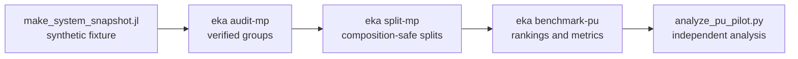

# EkaCompositions

**Reading the gaps in the inorganic record.**

EkaCompositions ranks canonical chemical compositions and evaluates reproducible
recovery experiments. It is for researchers testing stored scores and
composition-level ranking methods, and it supports SQLite score queries and
positive–unlabelled recovery benchmarks.

This site collects three kinds of material:

- **[Getting started](getting-started.md)** — installing the package, running a
  query from Julia, and the shape of the command-line interface.
- **[API reference](api.md)** — every exported name, grouped by the stability
  tier it belongs to under the
  [API contract](reference/api-stability.md).
- **Reference documents** — the project's methodological corpus, reproduced from
  the repository's `docs/` directory. These are the canonical records of what was
  run, under what protocol, and what the evidence showed.

## Orientation

If you want to *use* the package, read [Getting started](getting-started.md) and
then the [API reference](api.md).

If you want to *reproduce or extend the science*, start with the
[recovery findings](reference/recovery-findings.md) for what has been
established, then the [recovery roadmap](reference/recovery-roadmap.md) for what
is sequenced next. Every experiment is governed by a frozen protocol; the
protocol documents are content-hash-pinned and are never edited once a run has
cited them.

If you want to *contribute code*, the repository's `CONTRIBUTING.md` covers
setup, the test commands and the release gate, and
[API stability](reference/api-stability.md) says what may change without a
breaking release.

## Data and licensing

The package ships no real snapshot data. The bundled fixture is a twelve-row
software-testing artefact, not a set of predictions; see
[third-party notices](THIRD_PARTY_NOTICES.md) for its provenance. Materials
Project terms, attribution and redistribution limits are recorded in the
[data provenance review](reference/mp-data-provenance-review.md) and
[publication permissions](reference/publication-permissions.md).

## Pipeline

